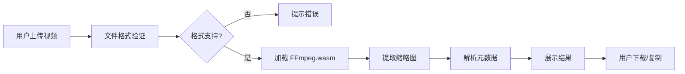

## 1. 产品概述

纯前端视频分析工具，利用 FFmpeg.wasm 技术在浏览器本地处理视频文件，无需上传服务器。主要解决用户快速获取视频元数据和缩略图的需求，保护隐私的同时提升处理效率。

- 核心价值：零服务器成本、隐私保护、即时处理
- 目标用户：内容创作者、视频编辑人员、开发测试人员

## 2. 核心功能

### 2.1 功能模块

1. **视频上传模块**：拖拽或点击上传，支持多种视频格式
2. **缩略图提取模块**：选择时间点提取高清缩略图，支持下载
3. **元数据解析模块**：读取编码格式、帧率、码率等详细信息，JSON 格式化展示
4. **处理状态展示**：实时显示 FFmpeg 加载和处理进度

### 2.3 页面详情

| 页面名称 | 模块名称 | 功能描述 |
|-----------|-------------|---------------------|
| 主页面 | 上传区域 | 拖拽上传、点击上传、格式提示 |
| 主页面 | 缩略图展示 | 时间轴选择、缩略图预览、下载按钮 |
| 主页面 | 元数据展示 | JSON 格式化视图、可折叠、一键复制 |
| 主页面 | 处理状态 | 加载动画、进度条、错误提示 |

## 3. 核心流程

用户上传视频 → 验证文件格式 → 加载 FFmpeg.wasm → 提取缩略图 → 解析元数据 → 展示结果 → 用户下载/复制

## 4. 用户界面设计

### 4.1 设计风格
- 主色调：深青色（#0891B2）+ 深灰背景（#0F172A），科技感十足
- 按钮风格：圆角 12px，悬停时有轻微缩放和发光效果
- 字体：JetBrains Mono（代码展示）+ Inter（正文）
- 布局：卡片式布局，左右分栏，左侧上传/预览，右侧数据展示
- 图标：lucide-react 线性图标，简洁现代

### 4.2 页面设计概述

| 页面名称 | 模块名称 | UI 元素 |
|-----------|-------------|-------------|
| 主页面 | 上传区域 | 虚线边框、上传图标、拖放动画、格式标签 |
| 主页面 | 缩略图区域 | 视频预览、时间滑块、下载按钮、阴影效果 |
| 主页面 | 元数据区域 | JSON 语法高亮、折叠箭头、复制按钮 |
| 主页面 | 状态区域 | 脉冲动画、进度条、错误提示卡片 |

### 4.3 响应式
- 桌面端：左右双栏布局
- 平板端：上下布局
- 移动端：单列布局，优化触摸区域
