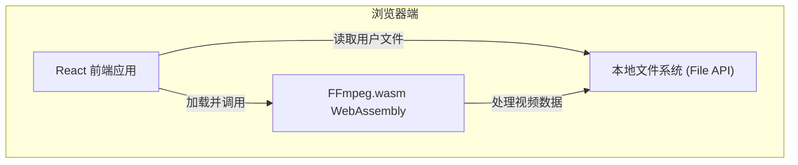

## 1. 架构设计



## 2. 技术描述

- 前端框架：React@18 + TypeScript
- 构建工具：Vite@5
- 样式方案：TailwindCSS@3
- 核心库：@ffmpeg/ffmpeg@0.12 (FFmpeg.wasm)
- 图标库：lucide-react
- 状态管理：zustand

## 3. 目录结构

```
src/
├── components/
│   ├── VideoUploader.tsx    # 视频上传组件
│   ├── ThumbnailExtractor.tsx  # 缩略图提取组件
│   ├── MetadataViewer.tsx   # 元数据展示组件
│   └── ProcessingStatus.tsx # 处理状态组件
├── hooks/
│   └── useFFmpeg.ts         # FFmpeg 封装 hook
├── utils/
│   └── videoParser.ts       # 视频解析工具函数
├── types/
│   └── video.ts             # 类型定义
├── App.tsx
└── main.tsx
```

## 4. 核心类型定义

```typescript
interface VideoMetadata {
  format: {
    filename: string;
    duration: number;
    size: number;
    bit_rate: number;
    format_name: string;
  };
  streams: Array<{
    codec_type: 'video' | 'audio';
    codec_name: string;
    width?: number;
    height?: number;
    r_frame_rate?: string;
    bit_rate?: string;
    sample_rate?: string;
    channels?: number;
  }>;
}

interface ProcessingState {
  isLoading: boolean;
  isReady: boolean;
  progress: number;
  error: string | null;
}
```

## 5. 技术要点

1. **FFmpeg.wasm 集成**：使用 CDN 加载核心和 wasm 文件，避免打包体积过大
2. **大文件处理**：使用 File System Access API 优化内存使用
3. **进度反馈**：通过 FFmpeg 日志解析实现处理进度显示
4. **错误处理**：完善的错误捕获和用户友好提示
5. **性能优化**：缩略图提取使用 seek 操作，避免全量解码
