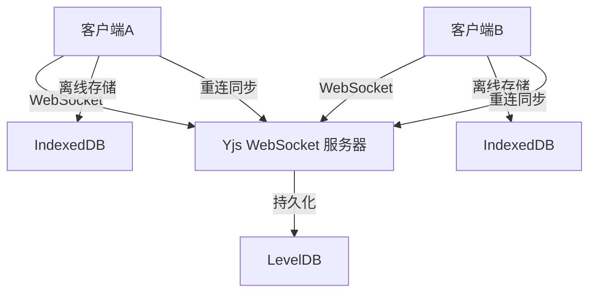

# 产品需求文档 (PRD) - Markdown 协同编辑器

## 1. 项目概述

### 1.1 项目背景
开发一个支持离线编辑的 Markdown 协同编辑器，使用 CRDT（Conflict-free Replicated Data Type）技术实现多人实时协同编辑。

### 1.2 项目目标
- 实现多客户端实时协同编辑
- 支持离线编辑，重连后自动同步
- 后端持久化文档状态和向量时钟
- 提供优雅的 Markdown 编辑和预览体验

## 2. 功能需求

### 2.1 核心功能
- **实时协同编辑**: 多用户同时编辑同一文档，实时看到对方的修改
- **离线编辑**: 断网期间可以继续编辑，网络恢复后自动同步
- **冲突自动合并**: 使用 Yjs CRDT 算法自动解决编辑冲突
- **Markdown 预览**: 分屏显示编辑器和预览效果
- **文档持久化**: 后端保存文档状态和更新历史

### 2.2 用户界面
- 简洁现代的编辑器界面
- 左侧编辑区，右侧预览区
- 在线状态指示器
- 协作者光标显示
- 连接状态提示

## 3. 技术架构

### 3.1 前端技术栈
- **框架**: React 18 + TypeScript
- **编辑器**: CodeMirror 6 + Yjs
- **状态管理**: Yjs (CRDT)
- **样式**: Tailwind CSS
- **通信**: WebSocket + y-websocket

### 3.2 后端技术栈
- **运行时**: Node.js + TypeScript
- **WebSocket**: ws + y-websocket
- **持久化**: LevelDB (存储 Yjs 文档)
- **向量时钟**: 集成在 Yjs 状态中

### 3.3 核心协议
- **同步协议**: Yjs 内置的 CRDT 同步协议
- **离线支持**: IndexedDB 本地存储 + 重连同步
- **持久化**: Yjs 更新向量 + LevelDB 存储

## 4. 数据流设计

## 5. 非功能需求

- **性能**: 支持至少 10 个并发用户
- **可靠性**: 离线数据不丢失，重连后自动同步
- **可扩展性**: 模块化设计，易于添加新功能
