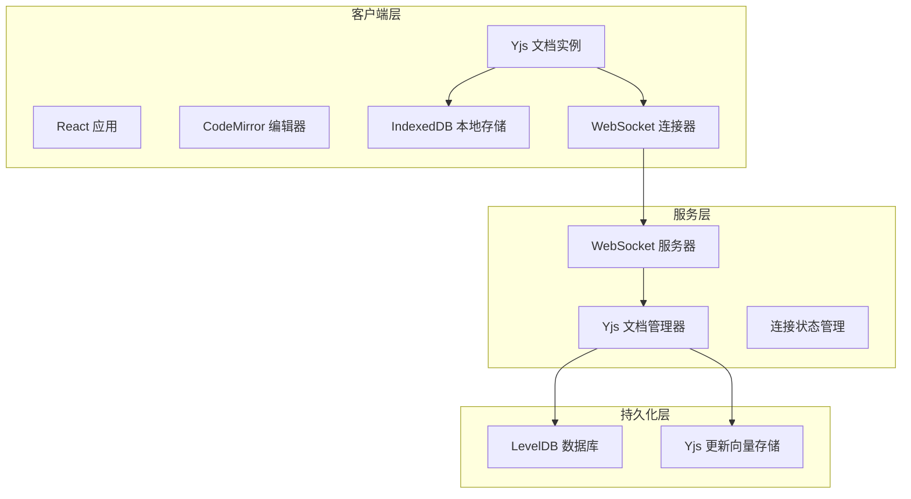

# 技术架构文档

## 1. 整体架构

### 1.1 系统架构图



## 2. 目录结构

```
markdown-collab-editor/
├── server/                 # 后端服务
│   ├── src/
│   │   ├── server.ts      # WebSocket 服务器入口
│   │   ├── persistence.ts # 持久化层
│   │   └── types.ts       # 类型定义
│   ├── package.json
│   └── tsconfig.json
├── client/                 # 前端应用
│   ├── src/
│   │   ├── App.tsx        # 主应用组件
│   │   ├── Editor.tsx     # 编辑器组件
│   │   ├── Preview.tsx    # Markdown 预览
│   │   ├── yjs-setup.ts   # Yjs 配置
│   │   └── index.tsx      # 入口文件
│   ├── package.json
│   ├── tsconfig.json
│   └── vite.config.ts
└── README.md
```

## 3. 核心技术实现

### 3.1 Yjs CRDT 实现

**核心概念**:
- Y.Doc: 共享文档实例
- Y.Text: 可共享的文本类型
- Y.XmlElement: 可共享的 XML 元素
- 更新向量 (Update Vector): 跟踪文档变更

**同步流程**:
1. 客户端创建 Y.Doc 实例
2. 通过 WebSocket 连接服务器
3. 服务器维护文档的主副本
4. 所有变更通过 Yjs 协议自动同步

### 3.2 离线编辑实现

**本地存储**:
- 使用 y-indexeddb 将文档状态持久化到 IndexedDB
- 断网时所有编辑保存在本地
- 重连时自动与服务器同步

**重连机制**:
- WebSocket 断线自动重连
- 重连后发送本地累积的更新
- 服务器合并后发送最新状态

### 3.3 后端持久化

**LevelDB 存储**:
- 存储每个文档的完整 Yjs 状态
- 定期保存更新向量
- 支持文档历史恢复

## 4. API 设计

### 4.1 WebSocket 协议

使用 Yjs 标准 WebSocket 协议，消息格式为二进制。

### 4.2 文档管理

- 文档 ID: URL 路径参数
- 默认文档: 'default'
- 多文档支持: 可创建多个独立文档

## 5. 开发与部署

### 5.1 开发环境
- 后端: nodemon 热重载
- 前端: Vite 开发服务器
- 端口: 后端 1234, 前端 5173

### 5.2 构建命令
```bash
# 后端
cd server && npm install && npm run dev

# 前端
cd client && npm install && npm run dev
```
