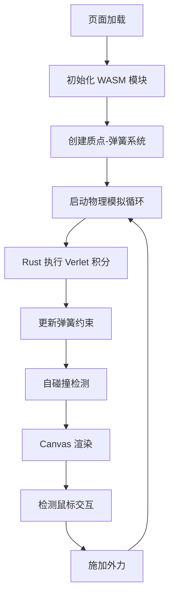

# 软体物理模拟器 - 产品需求文档

## 1. 产品概述

基于 Rust + WebAssembly 的实时质点-弹簧系统软体物理模拟器，实现类似 Jello 的弹性果冻效果。Rust 端负责高性能物理计算，前端 Canvas 负责渲染和交互。

- **核心目标**：展示 WebAssembly 在高性能物理模拟场景的优势
- **目标用户**：前端开发者、物理引擎爱好者、教育演示场景

## 2. 核心功能

### 2.1 功能模块

1. **物理引擎核心**（Rust/WASM）：Verlet 积分、质点-弹簧系统、自碰撞检测
2. **前端渲染**：HTML5 Canvas 实时渲染
3. **交互系统**：鼠标拖拽施加外力

### 2.2 页面详情

| 页面名称 | 模块名称 | 功能描述 |
|-----------|-------------|---------------------|
| 主页面 | Canvas 渲染区 | 实时显示软体物理模拟效果 |
| 主页面 | 控制面板 | 显示参数说明、重置按钮 |
| 主页面 | 交互提示 | 鼠标拖拽说明 |

## 3. 核心流程

## 4. 用户界面设计

### 4.1 设计风格
- **主色调**：深色背景 (#0a0a1a)，果冻主体使用渐变色（青色→蓝色）
- **辅助色**：网格线使用半透明灰色
- **字体**：现代无衬线字体，清晰易读
- **视觉风格**：科技感、简约、沉浸感
- **动效**：平滑的物理运动、鼠标悬停效果

### 4.2 页面设计概述

| 页面名称 | 模块名称 | UI 元素 |
|-----------|-------------|-------------|
| 主页面 | Canvas 区域 | 全屏画布、深色背景、发光果冻效果 |
| 主页面 | 标题区 | 大标题、副标题说明技术栈 |
| 主页面 | 提示文字 | 半透明悬浮在角落 |

### 4.3 响应式
- Canvas 自适应窗口大小
- 移动端触摸支持
