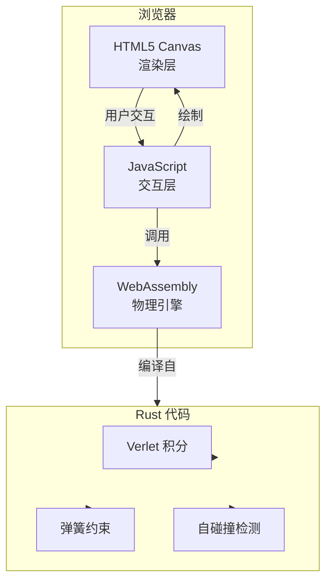

# 软体物理模拟器 - 技术架构文档

## 1. 架构设计



## 2. 技术栈描述

- **物理引擎**：Rust 1.70+ + wasm-bindgen + web-sys
- **前端**：原生 HTML5 + JavaScript + Canvas API
- **构建工具**：wasm-pack
- **本地服务**：简单 HTTP server

## 3. 项目结构

```
d84/
├── Cargo.toml
├── src/
│   └── lib.rs          # Rust 物理引擎
├── pkg/                # WASM 编译输出
├── index.html          # 前端页面
├── app.js              # 前端逻辑
└── style.css           # 样式文件
```

## 4. Rust 端核心数据结构

### 4.1 质点 (Point)
```rust
pub struct Point {
    x: f64,
    y: f64,
    old_x: f64,
    old_y: f64,
    pinned: bool,
    mass: f64,
}
```

### 4.2 弹簧 (Spring)
```rust
pub struct Spring {
    p1_idx: usize,
    p2_idx: usize,
    rest_length: f64,
    stiffness: f64,
}
```

### 4.3 软体系统 (SoftBody)
```rust
pub struct SoftBody {
    points: Vec&lt;Point&gt;,
    springs: Vec&lt;Spring&gt;,
    gravity: f64,
    damping: f64,
    point_radius: f64,
}
```

## 5. 核心算法

### 5.1 Verlet 积分
```
velocity = (current - previous) * damping
previous = current
current += velocity + acceleration * dt²
```

### 5.2 弹簧约束求解
对每个弹簧迭代多次，调整两端质点位置：
```
diff = p2 - p1
dist = length(diff)
offset = (dist - rest_length) / dist * 0.5
p1 += diff * offset * stiffness
p2 -= diff * offset * stiffness
```

### 5.3 自碰撞检测
空间网格划分 + 质点间距离检测：
- 将空间划分为多个网格单元
- 每个质点映射到对应网格
- 只检测相邻网格内的质点
- 若距离小于 2*radius，施加排斥力

## 6. 前端 API

JavaScript 与 WASM 交互接口：
```javascript
// 初始化软体系统
const softBody = wasm.create_soft_body(centerX, centerY, size, spacing);

// 物理更新
softBody.update(dt, iterations);

// 施加力
softBody.apply_force(x, y, radius, forceX, forceY);

// 获取质点位置
const positions = softBody.get_positions();
```
