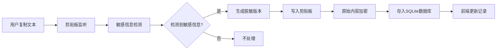

## 1. 产品概述

剪贴板敏感信息脱敏工具是一款基于 Electron + React 开发的桌面应用，旨在保护用户隐私安全。当用户复制包含敏感信息的文本时，自动检测并进行脱敏处理，同时将原始内容加密存储。

- 解决问题：防止敏感信息（身份证号、API Key、IP地址等）意外泄露
- 目标用户：开发人员、办公人员、任何处理敏感数据的用户
- 产品价值：实时保护隐私安全，防止敏感信息意外泄露

## 2. 核心功能

### 2.2 功能模块
1. **主界面**: 剪贴板历史记录展示、搜索过滤、统计信息
2. **设置面板**: 检测规则配置、脱敏格式设置、加密选项

### 2.3 页面详情

| 页面名称 | 模块名称 | 功能描述 |
|-----------|-------------|---------------------|
| 主界面 | 历史记录列表 | 展示脱敏记录列表，支持查看原始内容、时间、类型 |
| 主界面 | 统计面板 | 显示检测次数、脱敏类型分布 |
| 设置面板 | 规则配置 | 启用/禁用各类敏感信息检测规则 |
| 设置面板 | 脱敏设置 | 自定义脱敏格式（如 ***-****-1234） |

## 3. 核心流程

用户复制文本 → 系统剪贴板监听触发 → 敏感信息正则匹配检测 → 检测到敏感信息 → 生成脱敏版本 → 写入剪贴板 → 原始内容加密 → 存入 SQLite 数据库 → 前端界面更新记录

## 4. 用户界面设计

### 4.1 设计风格
- **主色调**: 深蓝色 (#165DFF) - 传达安全、专业感
- **辅助色**: 绿色 (#00B42A) 成功提示，橙色 (#FF7D00) 警告
- **背景色**: 深灰 (#1D2129) 深色主题，护眼且专业
- **按钮风格**: 圆角 8px，悬停有轻微缩放效果
- **字体**: Inter - 现代无衬线字体，清晰易读
- **布局风格**: 卡片式布局，左侧导航 + 右侧内容区
- **图标风格**: Lucide 图标库，简洁线性风格

### 4.2 页面设计概述

| 页面名称 | 模块名称 | UI Elements |
|-----------|-------------|-------------|
| 主界面 | 历史记录 | 深色卡片、时间轴样式、悬停高亮、平滑过渡动画 |
| 设置面板 | 配置项 | 开关组件、滑块调节、分组折叠、实时预览效果 |

### 4.3 响应性
- 桌面端优先，支持窗口大小调整
- 最小窗口尺寸: 800x600px
- 自适应布局，内容区域可滚动
