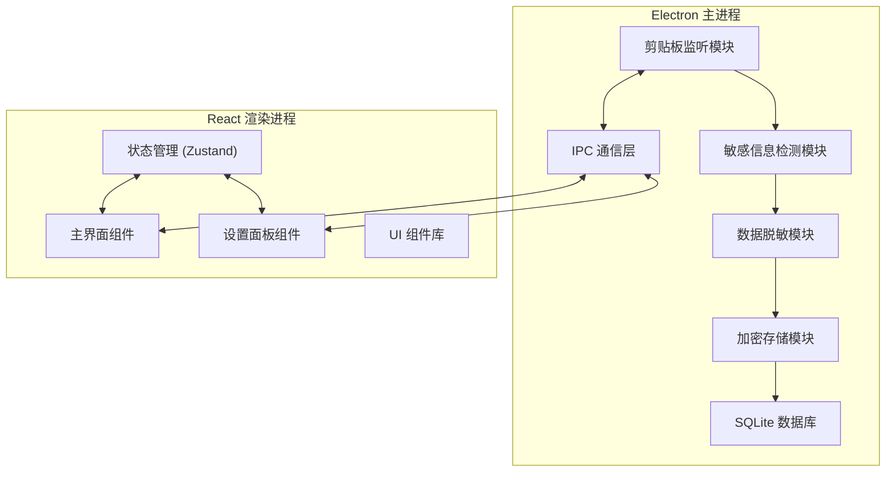

## 1. 架构设计



## 2. 技术栈说明

- **Electron@29**: 桌面应用框架，提供系统级 API 访问
- **React@18**: 前端 UI 框架
- **Vite@5**: 构建工具，快速开发体验
- **TypeScript@5**: 类型安全
- **better-sqlite3@9**: SQLite 数据库驱动，性能优秀
- **crypto**: Node.js 内置加密模块（AES-256-GCM）
- **Zustand@4**: 轻量级状态管理
- **TailwindCSS@3**: CSS 框架
- **Lucide React**: 图标库

## 3. 关键模块定义

### 3.1 剪贴板监听模块
- 位置: `electron/main/clipboard-monitor.ts`
- 功能: 定时轮询系统剪贴板，检测内容变化
- 间隔: 500ms

### 3.2 敏感信息检测模块
- 位置: `electron/main/sensitive-detector.ts`
- 支持检测类型:
  - 身份证号 (18位)
  - API Key (常见格式如 sk_xxx, pk_xxx)
  - IP 地址 (IPv4)
  - 手机号
  - 邮箱地址

### 3.3 数据脱敏模块
- 位置: `electron/main/data-masker.ts`
- 脱敏规则: 保留前后几位，中间用 * 替换
- 可配置脱敏格式

### 3.4 加密存储模块
- 位置: `electron/main/encryption.ts`
- 算法: AES-256-GCM
- 密钥: 用户首次启动时生成并存储在系统密钥链

## 4. 数据模型

### 4.1 数据库表设计

```mermaid
erDiagram
    CLIPBOARD_RECORDS {
        INTEGER id PK
        TEXT original_content "加密存储"
        TEXT masked_content
        TEXT sensitive_type "身份证/APIKey/IP/手机号/邮箱"
        DATETIME created_at
        TEXT iv "加密初始向量"
        TEXT auth_tag "GCM认证标签"
    }
    
    SETTINGS {
        INTEGER id PK
        TEXT key_name UNIQUE
        TEXT value
        DATETIME updated_at
    }
```

### 4.2 DDL 语句

```sql
CREATE TABLE IF NOT EXISTS clipboard_records (
    id INTEGER PRIMARY KEY AUTOINCREMENT,
    original_content TEXT NOT NULL,
    masked_content TEXT NOT NULL,
    sensitive_type TEXT NOT NULL,
    created_at DATETIME DEFAULT CURRENT_TIMESTAMP,
    iv TEXT NOT NULL,
    auth_tag TEXT NOT NULL
);

CREATE TABLE IF NOT EXISTS settings (
    id INTEGER PRIMARY KEY AUTOINCREMENT,
    key_name TEXT UNIQUE NOT NULL,
    value TEXT NOT NULL,
    updated_at DATETIME DEFAULT CURRENT_TIMESTAMP
);

CREATE INDEX idx_records_created ON clipboard_records(created_at DESC);
CREATE INDEX idx_records_type ON clipboard_records(sensitive_type);
```

## 5. IPC 通信通道

| 通道名称 | 方向 | 用途 |
|----------|------|------|
| `get-records` | Renderer → Main | 获取历史记录列表 |
| `get-record-detail` | Renderer → Main | 获取单条记录详情（解密） |
| `delete-record` | Renderer → Main | 删除记录 |
| `clear-records` | Renderer → Main | 清空所有记录 |
| `get-stats` | Renderer → Main | 获取统计数据 |
| `get-settings` | Renderer → Main | 获取设置 |
| `update-settings` | Renderer → Main | 更新设置 |
| `new-record` | Main → Renderer | 新记录通知 |
| `monitor-status` | Main → Renderer | 监听状态变化 |
