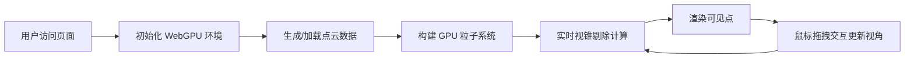

## 1. 产品概述

高性能 3D 点云数据可视化应用，基于 Three.js WebGPU 后端实现，支持 .las/.ply 格式地形扫描数据渲染。
- 核心目标：高效渲染约 100 万个点的点云数据，提供流畅的 3D 交互体验
- 目标用户：GIS 专业人员、3D 数据可视化开发者、地形分析研究者

## 2. 核心功能

### 2.1 功能模块
1. **主界面**: 3D 点云渲染画布、控制面板、状态信息
2. **点云加载模块**: 支持 .las/.ply 格式点云数据加载
3. **渲染优化模块**: GPU 粒子系统 + 视锥剔除

### 2.2 页面详情
| 页面名称 | 模块名称 | 功能描述 |
|-----------|-------------|---------------------|
| 主页面 | 3D 画布 | WebGPU 渲染点云，支持鼠标交互 |
| 主页面 | 控制面板 | 显示点云统计信息，渲染参数调节 |
| 主页面 | 状态栏 | 显示 FPS、渲染点数、内存占用 |

## 3. 核心流程

## 4. 用户界面设计

### 4.1 设计风格
- **主色调**: 深色科技风，背景色 #0a0a0f，强调色 #00d4ff
- **按钮风格**: 圆角 4px，半透明玻璃质感，微妙悬停动效
- **字体**: JetBrains Mono 等宽字体，代码风格
- **布局风格**: 沉浸式全屏画布，悬浮控制面板
- **图标风格**: 简约线性图标，科技感

### 4.2 页面设计概述
| 页面名称 | 模块名称 | UI 元素 |
|-----------|-------------|-------------|
| 主页面 | 3D 画布 | 全屏、深色背景、粒子光晕效果 |
| 主页面 | 控制面板 | 右上角悬浮、半透明、毛玻璃效果 |
| 主页面 | 状态栏 | 底部固定、实时数据更新 |

### 4.3 响应性
- 桌面端优先，自适应窗口大小
- 画布始终占满视口
- 控制面板在小屏幕自动折叠

### 4.4 3D 场景指引
- **环境**: 纯黑背景，星空感粒子点缀
- **光照**: 使用点云自身颜色渲染，无额外光照
- **相机设置**: 透视相机，初始距离适中，OrbitControls 控制
- **交互**: 鼠标左键旋转，右键平移，滚轮缩放
- **动效**: 平滑相机过渡，点云加载渐显动画
