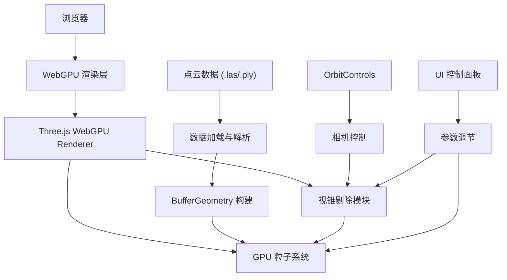

## 1. 架构设计



## 2. 技术说明

- **前端框架**: React@18 + Vite
- **3D 引擎**: Three.js r160+ (WebGPU 后端)
- **点云加载**: THREE.PLYLoader, las.js 或自定义解析
- **状态管理**: React useState/useRef
- **样式**: TailwindCSS 3 + CSS Modules

## 3. 核心技术实现

### 3.1 WebGPU 初始化
- 使用 `THREE.WebGPURenderer` 替代 `WebGLRenderer`
- 配置 WebGPU 特性：深度测试、混合模式
- 异步初始化，处理浏览器兼容性

### 3.2 GPU 粒子系统
- 使用 `THREE.Points` 配合自定义 WebGPU Shader
- 每个点使用 `BufferAttribute` 存储：位置、颜色、大小
- Shader 中实现点精灵渲染、抗锯齿

### 3.3 视锥剔除优化
- CPU 端：八叉树/网格空间划分
- GPU 端：计算着色器视锥测试
- 动态更新可见点索引缓冲区
- 每帧执行剔除，性能开销 < 1ms

### 3.4 点云数据生成/加载
- 模拟：程序化生成类地形点云（柏林噪声）
- 实际：支持 .ply 和 .las 格式加载
- 数据预处理：归一化、下采样（如需）

## 4. 目录结构

```
src/
├── components/
│   ├── PointCloudViewer.jsx    # 主渲染组件
│   ├── ControlPanel.jsx        # 控制面板
│   └── StatusBar.jsx           # 状态栏
├── utils/
│   ├── pointCloudGenerator.js  # 模拟点云生成
│   ├── frustumCulling.js       # 视锥剔除算法
│   └── shaders.js               # WebGPU Shader
├── App.jsx
├── main.jsx
└── index.css
```

## 5. 性能指标

| 指标 | 目标值 |
|------|--------|
| 总点数 | 1,000,000 |
| FPS | ≥ 60 |
| GPU 内存占用 | < 200MB |
| 视锥剔除时间 | < 1ms/帧 |
