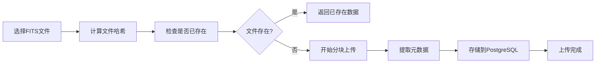

## 1. 产品概述

射电望远镜观测数据归档系统，用于存储、管理和检索射电天文观测的FITS格式数据。系统提供大文件分块上传、元数据存储和天球图可视化检索功能，主要面向天文学家和科研人员。

- 核心目标：实现天文观测数据的可靠归档和高效检索
- 目标用户：天文学家、天文研究机构、数据管理员

## 2. 核心功能

### 2.1 用户角色

| 角色 | 注册方式 | 核心权限 |
|------|---------|---------|
| 管理员 | 系统创建 | 数据上传、管理、检索 |
| 研究员 | 管理员邀请 | 数据检索、下载 |

### 2.2 功能模块

1. **数据上传页面**：分块上传FITS文件，实时进度显示
2. **天球图检索页面**：基于Leaflet的天区框选检索
3. **数据详情页面**：显示观测元数据和下载选项
4. **数据列表页面**：所有归档数据的表格展示和筛选

### 2.3 页面详情

| 页面名称 | 模块名称 | 功能描述 |
|---------|---------|----------|
| 数据上传页面 | 分块上传组件 | 拖拽上传、分块进度、哈希校验、元数据提取 |
| 天球图检索页面 | Leaflet天球图 | Mollweide投影、框选工具、结果标注 |
| 数据详情页面 | 元数据展示 | 观测时间、频率范围、赤经赤纬、文件信息 |
| 数据列表页面 | 数据表格 | 分页、筛选、排序、批量操作 |

## 3. 核心流程

### 3.1 数据上传流程

### 3.2 数据检索流程

## 4. 用户界面设计

### 4.1 设计风格

- **主色调**：深空蓝 (#0A192F)，代表宇宙和科学探索
- **辅助色**：科技青 (#64FFDA)，用于交互元素和高亮
- **中性色**：深灰 (#112240)、浅灰 (#8892B0)、白色 (#CCD6F6)
- **按钮风格**：圆角矩形，科技青边框，悬停时有光晕效果
- **字体**：主要使用 JetBrains Mono（等宽字体，科技感），配合 Inter 作为辅助字体
- **布局风格**：深色主题，卡片式布局，玻璃拟态效果
- **图标风格**：线性图标，简洁现代，统一24px尺寸

### 4.2 页面设计概述

| 页面名称 | 模块名称 | UI元素 |
|---------|---------|--------|
| 数据上传页面 | 分块上传组件 | 拖拽区域、进度条、分块状态、哈希显示 |
| 天球图检索页面 | Leaflet天球图 | 全屏地图、框选工具、结果标记、侧边面板 |
| 数据详情页面 | 元数据展示 | 信息卡片、坐标可视化、下载按钮 |
| 数据列表页面 | 数据表格 | 筛选器、分页控件、行高亮 |

### 4.3 响应式设计

- **桌面优先**：1920px宽度为基准，1440px为主要适配宽度
- **平板适配**：1024px宽度，侧边栏折叠为抽屉菜单
- **移动端**：768px以下，单列布局，触摸优化的交互元素

### 4.4 动效设计

- 页面加载时的渐显动画
- 上传进度的平滑过渡
- 天球图框选的动态边框效果
- 卡片悬停时的微缩放和阴影变化
- 数据加载时的骨架屏动画

