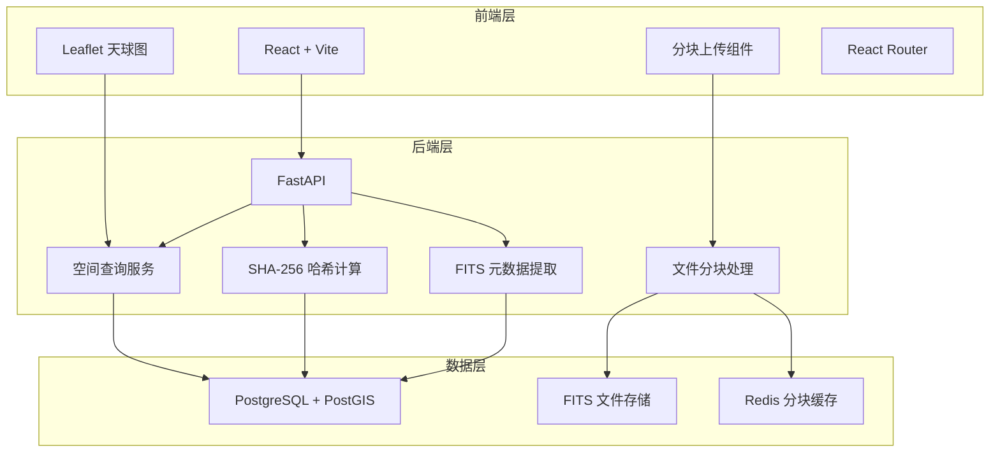
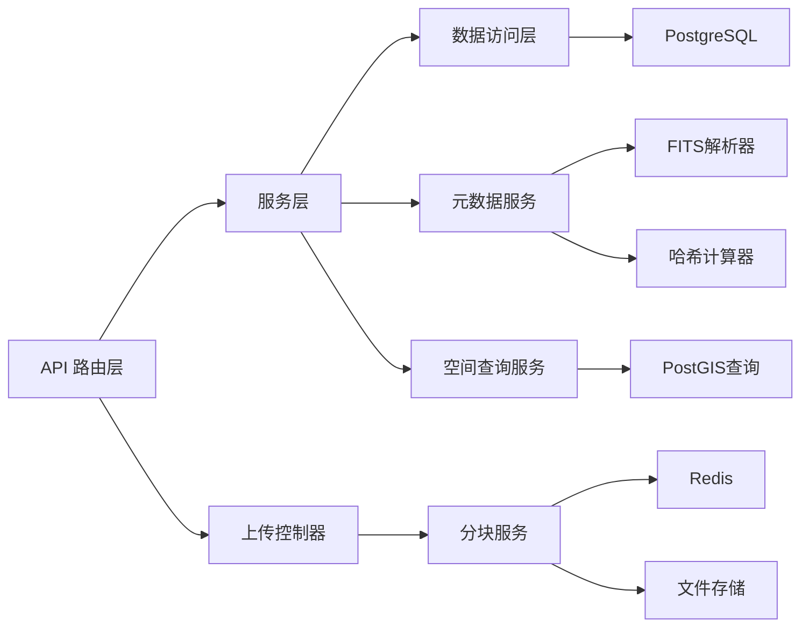
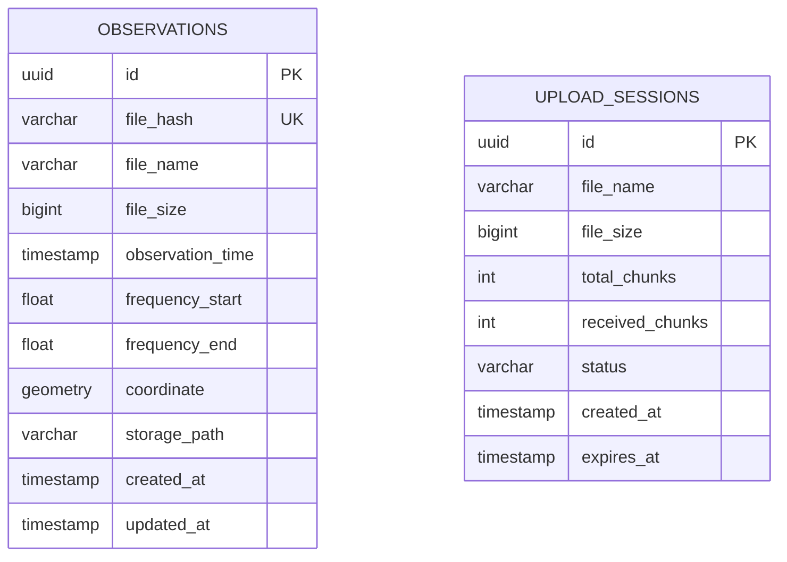

## 1. 架构设计



## 2. 技术描述

### 2.1 前端技术栈
- **框架**: React@18 + TypeScript
- **构建工具**: Vite@5
- **样式方案**: TailwindCSS@3 + CSS Modules
- **路由**: React Router@6
- **天球图**: Leaflet@1.9 + Proj4Leaflet
- **状态管理**: Zustand
- **HTTP客户端**: Axios
- **UI组件**: Headless UI + Heroicons

### 2.2 后端技术栈
- **框架**: FastAPI@0.109
- **数据库驱动**: SQLAlchemy@2 + asyncpg
- **FITS处理**: astropy@6
- **空间数据**: GeoAlchemy2
- **文件存储**: 本地文件系统 (可扩展到S3)
- **缓存**: Redis (分块上传会话)

### 2.3 数据库
- **PostgreSQL@16** + PostGIS@3 扩展
- **空间索引**: GIST索引用于天区范围查询

## 3. 路由定义

| 路由 | 页面 | 功能描述 |
|------|------|---------|
| / | 首页 | 系统概览、快速导航 |
| /upload | 数据上传 | FITS文件分块上传 |
| /sky-map | 天球图检索 | 基于天区的可视化检索 |
| /data | 数据列表 | 所有观测数据列表 |
| /data/:id | 数据详情 | 单个观测数据详情和下载 |

## 4. API 定义

### 4.1 分块上传 API

```typescript
// 初始化上传
interface UploadInitRequest {
  fileName: string;
  fileSize: number;
  fileType: string;
  totalChunks: number;
}

interface UploadInitResponse {
  uploadId: string;
  chunkSize: number;
}

// 上传分块
interface ChunkUploadRequest {
  uploadId: string;
  chunkIndex: number;
  chunkData: Blob;
}

interface ChunkUploadResponse {
  received: boolean;
  chunkIndex: number;
}

// 完成上传
interface UploadCompleteRequest {
  uploadId: string;
  fileHash: string;
}

interface UploadCompleteResponse {
  success: boolean;
  observationId: string;
  metadata: ObservationMetadata;
}
```

### 4.2 数据检索 API

```typescript
interface SpatialQueryRequest {
  raMin: number;
  raMax: number;
  decMin: number;
  decMax: number;
  page?: number;
  pageSize?: number;
}

interface ObservationMetadata {
  id: string;
  observationTime: string;
  frequencyStart: number;
  frequencyEnd: number;
  ra: number;
  dec: number;
  fileName: string;
  fileSize: number;
  fileHash: string;
  createdAt: string;
}

interface ObservationListResponse {
  data: ObservationMetadata[];
  total: number;
  page: number;
  pageSize: number;
}
```

## 5. 后端服务架构



## 6. 数据模型

### 6.1 ER 图



### 6.2 DDL 语句

```sql
-- 启用 PostGIS 扩展
CREATE EXTENSION IF NOT EXISTS postgis;
CREATE EXTENSION IF NOT EXISTS postgis_topology;

-- 观测数据表
CREATE TABLE observations (
    id UUID PRIMARY KEY DEFAULT gen_random_uuid(),
    file_hash VARCHAR(64) UNIQUE NOT NULL,
    file_name VARCHAR(255) NOT NULL,
    file_size BIGINT NOT NULL,
    observation_time TIMESTAMPTZ NOT NULL,
    frequency_start DOUBLE PRECISION NOT NULL,
    frequency_end DOUBLE PRECISION NOT NULL,
    coordinate GEOMETRY(Point, 4326) NOT NULL,
    storage_path VARCHAR(512) NOT NULL,
    created_at TIMESTAMPTZ DEFAULT CURRENT_TIMESTAMP,
    updated_at TIMESTAMPTZ DEFAULT CURRENT_TIMESTAMP
);

-- 空间索引
CREATE INDEX idx_observations_coordinate ON observations USING GIST(coordinate);

-- 哈希索引
CREATE INDEX idx_observations_file_hash ON observations(file_hash);

-- 上传会话表
CREATE TABLE upload_sessions (
    id UUID PRIMARY KEY DEFAULT gen_random_uuid(),
    file_name VARCHAR(255) NOT NULL,
    file_size BIGINT NOT NULL,
    total_chunks INTEGER NOT NULL,
    received_chunks INTEGER DEFAULT 0,
    status VARCHAR(20) DEFAULT 'pending',
    created_at TIMESTAMPTZ DEFAULT CURRENT_TIMESTAMP,
    expires_at TIMESTAMPTZ NOT NULL
);

-- 过期索引
CREATE INDEX idx_upload_sessions_expires ON upload_sessions(expires_at);
```

## 7. 分块上传设计

### 7.1 分块策略
- **分块大小**: 5MB (可配置)
- **并发上传**: 最多3个并发连接
- **断点续传**: 支持上传中断后继续
- **哈希校验**: 每块MD5校验 + 整体SHA-256校验

### 7.2 上传流程
1. 前端计算文件总哈希
2. 发送初始化请求，获取uploadId
3. 分块并发上传，每块附带索引和校验
4. 后端接收并缓存分块
5. 全部接收后合并文件
6. 验证整体哈希
7. 提取FITS元数据
8. 存储到数据库

