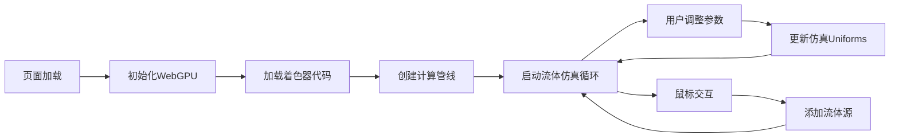

## 1. 产品概述

基于浏览器的流体仿真工具，利用WebGPU技术实现高性能的实时流体动力学模拟。通过直观的UI控制参数，让用户能够观察和交互流体流动效果。

- 核心目的：提供浏览器端高性能流体仿真体验，展示WebGPU计算能力
- 目标用户：图形学爱好者、教育工作者、创意开发者
- 产品价值：无需安装即可体验专业级流体模拟，用于教育演示和创意实验

## 2. 核心功能

### 2.1 用户角色
| 角色 | 注册方式 | 核心权限 |
|------|---------|---------|
| 普通用户 | 无需注册 | 使用所有仿真功能，调整参数 |

### 2.2 功能模块
1. **流体仿真主界面**：实时流体渲染画布，参数控制面板
2. **参数控制模块**：流速、粘度、重力调节滑块
3. **交互功能**：鼠标/触摸交互添加流体源

### 2.3 页面详情
| 页面名称 | 模块名称 | 功能描述 |
|---------|---------|---------|
| 主界面 | 仿真画布 | WebGPU渲染流体实时动画，支持鼠标交互添加流体 |
| 主界面 | 参数控制面板 | 三个滑块分别控制流速、粘度、重力参数 |
| 主界面 | 信息展示 | 显示FPS、分辨率等性能指标 |

## 3. 核心流程

用户访问页面后，系统自动初始化WebGPU环境，加载WGSL计算着色器，创建计算管线和渲染管线，然后启动仿真循环。用户可以通过滑块实时调整流体参数，也可以通过鼠标在画布上交互添加流体源。

## 4. 用户界面设计

### 4.1 设计风格
- **主色调**：深色科技风格，深蓝色(#0a192f)背景，青色(#64ffda)强调色
- **辅助色**：流体渲染使用渐变色谱，从深蓝到青色过渡
- **按钮风格**：圆角矩形，半透明背景，悬停时发光效果
- **字体**：现代无衬线字体，JetBrains Mono用于数值显示
- **布局风格**：画布居中，控制面板悬浮右侧，半透明玻璃拟态效果
- **图标风格**：简约线性图标，科技感十足

### 4.2 页面设计概览
| 页面名称 | 模块名称 | UI元素 |
|---------|---------|--------|
| 主界面 | 仿真画布 | 全屏流体渲染，鼠标交互反馈 |
| 主界面 | 控制面板 | 三个带数值显示的滑块，标签清晰 |
| 主界面 | 性能指标 | 右上角FPS显示，小字半透明 |

### 4.3 响应式
- Desktop-first设计，全屏画布体验
- 移动端自适应布局，控制面板移至底部
- 触摸交互优化，支持多点触控添加流体

### 4.4 视觉特效
- 流体粒子使用半透明叠加效果
- 参数调整时的平滑过渡动画
- 鼠标悬停时的微妙发光效果
- 页面加载时的渐入动画
