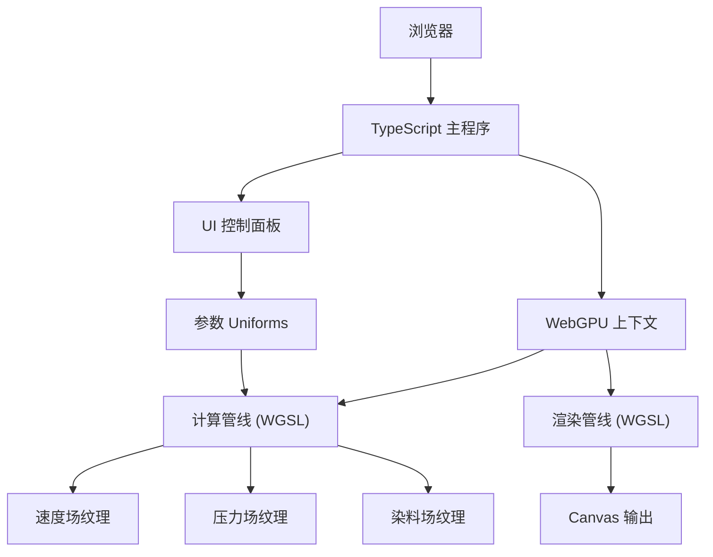

## 1. 架构设计



## 2. 技术描述

- **前端框架**：原生 TypeScript + Vite
- **图形API**：WebGPU (WebGPU Shading Language - WGSL)
- **构建工具**：Vite@5
- **样式方案**：原生 CSS + CSS 变量
- **算法核心**：基于稳定流体的 Navier-Stokes 方程求解

### 核心技术栈说明
1. **Vite**：快速的开发服务器和构建工具，支持 TypeScript 和 WebGPU 着色器导入
2. **WebGPU**：现代GPU API，提供计算着色器能力，实现高性能并行计算
3. **WGSL**：WebGPU着色器语言，编写计算和渲染着色器
4. **TypeScript**：类型安全的JavaScript超集，管理复杂的GPU管线

## 3. 项目结构

```
e:\soloD\d93\
├── src/
│   ├── shaders/
│   │   ├── advection.wgsl      # 对流步骤计算着色器
│   │   ├── diffusion.wgsl      # 扩散步骤计算着色器
│   │   ├── projection.wgsl     # 投影步骤计算着色器
│   │   ├── pressure.wgsl       # 压力求解计算着色器
│   │   └── render.wgsl         # 最终渲染着色器
│   ├── FluidSimulator.ts       # 流体仿真核心类
│   ├── WebGPURenderer.ts       # WebGPU渲染器封装
│   ├── UIController.ts         # UI控制器
│   ├── main.ts                 # 程序入口
│   └── styles.css              # 样式文件
├── index.html
├── package.json
├── tsconfig.json
└── vite.config.ts
```

## 4. 流体仿真算法流程

### Navier-Stokes 求解步骤


### 核心数据结构
```typescript
interface FluidParams {
  velocity: number;      // 流速
  viscosity: number;     // 粘度
  gravity: number;       // 重力
  dt: number;            // 时间步长
}

interface SimulationTextures {
  velocity: GPUTexture;
  velocityNext: GPUTexture;
  pressure: GPUTexture;
  pressureNext: GPUTexture;
  dye: GPUTexture;
  dyeNext: GPUTexture;
}
```

## 5. 计算着色器绑定设计

### Uniform Buffer 布局
```wgsl
struct Params {
  resolution: vec2<f32>,
  dt: f32,
  velocity: f32,
  viscosity: f32,
  gravity: f32,
}

@group(0) @binding(0) var<uniform> params: Params;
@group(0) @binding(1) var inputTex: texture_2d<f32>;
@group(0) @binding(2) var outputTex: texture_storage_2d<rgba32float, write>;
```

### TypeScript 绑定层
```typescript
// 创建Uniform缓冲区
const uniformBuffer = device.createBuffer({
  size: 32, // 对齐到256位
  usage: GPUBufferUsage.UNIFORM | GPUBufferUsage.COPY_DST,
});

// 更新参数
function updateParams(params: FluidParams) {
  const data = new Float32Array([
    width, height,
    params.dt,
    params.velocity,
    params.viscosity,
    params.gravity,
  ]);
  device.queue.writeBuffer(uniformBuffer, 0, data);
}
```

## 6. 性能优化策略

1. **纹理双缓冲**：使用读写分离的纹理对，避免读写冲突
2. **工作组大小**：使用 16x16 工作组，充分利用GPU并行能力
3. **精度控制**：使用 rgba32float 纹理格式，平衡精度和性能
4. **减少拷贝**：所有计算在GPU纹理间进行，最小化CPU-GPU数据传输
