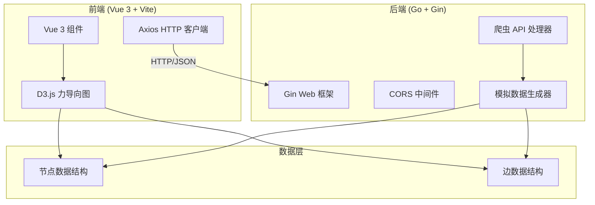
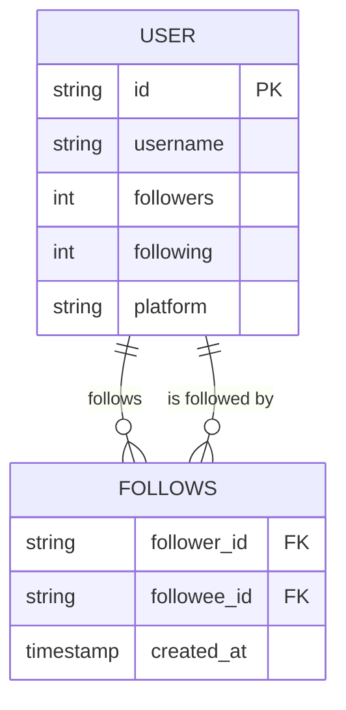

# 社交媒体关系图谱工具 - 技术架构文档

## 1. 架构设计



## 2. 技术描述

### 2.1 前端技术栈
- **框架**: Vue 3 (Composition API) + Vite
- **图表库**: D3.js v7 (力导向图可视化)
- **HTTP 客户端**: Axios
- **样式**: CSS3 变量 + 自定义动画
- **字体**: Google Fonts (Orbitron + Inter)

### 2.2 后端技术栈
- **语言**: Go 1.21+
- **Web 框架**: Gin (高性能 HTTP 框架)
- **中间件**: CORS (跨域支持)
- **数据**: 内存模拟数据生成

## 3. 项目结构

```
social-graph/
├── backend/
│   ├── main.go           # 主入口
│   ├── go.mod            # Go 依赖
│   ├── handler/
│   │   └── graph.go      # API 处理器
│   └── model/
│       └── graph.go      # 数据模型
└── frontend/
    ├── package.json
    ├── vite.config.js
    ├── index.html
    └── src/
        ├── main.js
        ├── App.vue
        ├── components/
        │   ├── Graph.vue       # 力导向图组件
        │   ├── ControlPanel.vue # 控制面板
        │   └── InfoPanel.vue    # 信息面板
        └── api/
            └── graph.js         # API 调用
```

## 4. 路由定义

### 4.1 前端路由
| 路由 | 用途 |
|-------|---------|
| / | 主页面 - 图谱展示与交互 |

### 4.2 后端 API 路由
| 方法 | 路由 | 用途 |
|-------|--------|---------|
| GET | /api/health | 健康检查 |
| POST | /api/graph/fetch | 抓取用户关系图谱 |

## 5. API 定义

### 5.1 抓取图谱 API

**请求**:
```typescript
interface FetchGraphRequest {
  platform: 'twitter' | 'github';
  username: string;
  depth?: number;  // 默认 2 层
}
```

**响应**:
```typescript
interface GraphData {
  nodes: Node[];
  links: Link[];
  metadata: {
    platform: string;
    rootUser: string;
    nodeCount: number;
    linkCount: number;
  };
}

interface Node {
  id: string;
  username: string;
  avatar?: string;
  followers?: number;
  following?: number;
  group?: number;
}

interface Link {
  source: string;
  target: string;
  value?: number;
}
```

## 6. 数据模型

### 6.1 ER 图（概念模型）



### 6.2 Go 数据结构

```go
type Node struct {
    ID        string `json:"id"`
    Username  string `json:"username"`
    Followers int    `json:"followers,omitempty"`
    Following int    `json:"following,omitempty"`
    Group     int    `json:"group,omitempty"`
}

type Link struct {
    Source string `json:"source"`
    Target string `json:"target"`
    Value  int    `json:"value,omitempty"`
}

type GraphData struct {
    Nodes    []Node `json:"nodes"`
    Links    []Link `json:"links"`
    Metadata struct {
        Platform string `json:"platform"`
        RootUser string `json:"rootUser"`
        NodeCount int   `json:"nodeCount"`
        LinkCount int   `json:"linkCount"`
    } `json:"metadata"`
}
```

## 7. D3.js 力导向图配置

```javascript
const simulation = d3.forceSimulation(nodes)
  .force("link", d3.forceLink(links).id(d => d.id).distance(100))
  .force("charge", d3.forceManyBody().strength(-300))
  .force("center", d3.forceCenter(width / 2, height / 2))
  .force("collision", d3.forceCollide().radius(50));
```

## 8. CORS 配置

后端允许跨域请求，配置：
- 允许来源: `http://localhost:5173` (开发环境)
- 允许方法: GET, POST, OPTIONS
- 允许头: Content-Type

## 9. 性能优化

- 前端: 节点数量限制为 100 个以内，避免性能下降
- 后端: 限制深度参数（maxDepth = 3）
- 渲染: 使用 SVG 虚拟化，只渲染视口内元素
