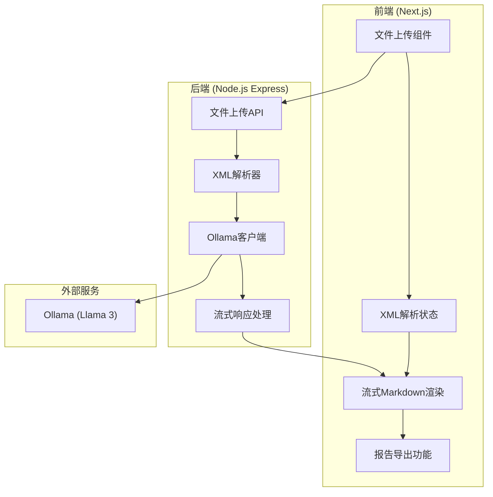

## 1. 架构设计



## 2. 技术描述

- **前端**: Next.js 14 (App Router) + TypeScript + Tailwind CSS
- **后端**: Express.js 4 + TypeScript
- **XML解析**: xml2js
- **LLM集成**: Ollama官方SDK
- **Markdown渲染**: react-markdown + react-syntax-highlighter
- **图标库**: Lucide React

## 3. 项目结构

```
d95/
├── client/                 # Next.js前端
│   ├── app/
│   │   ├── page.tsx       # 主页面
│   │   └── globals.css    # 全局样式
│   ├── components/
│   │   ├── FileUpload.tsx
│   │   ├── MarkdownRenderer.tsx
│   │   └── StatusIndicator.tsx
│   └── package.json
├── server/                 # Express后端
│   ├── src/
│   │   ├── index.ts       # 服务器入口
│   │   ├── routes/
│   │   │   └── analyze.ts # 分析API路由
│   │   └── services/
│   │       ├── xmlParser.ts
│   │       └── ollama.ts  # Ollama服务
│   └── package.json
└── README.md
```

## 4. 路由定义

### 前端路由
| 路由 | 用途 |
|-------|---------|
| / | 主页面 - 文件上传和结果展示 |

### 后端API
| 路由 | 方法 | 用途 |
|-------|------|---------|
| /api/analyze | POST | 上传XML文件并开始分析 |
| /api/health | GET | 健康检查 |

## 5. API定义

### POST /api/analyze
**请求**: multipart/form-data
```typescript
interface AnalyzeRequest {
  file: File; // Nmap XML扫描文件
}
```

**响应**: text/event-stream (流式)
```typescript
// 流式响应格式
type StreamResponse = string; // 逐块返回Markdown内容
```

### 数据类型定义
```typescript
interface NmapPort {
  portid: string;
  protocol: string;
  state: string;
  service?: {
    name: string;
    version?: string;
    product?: string;
  };
}

interface NmapHost {
  address: string;
  ports: NmapPort[];
  hostname?: string;
}

interface ScanResult {
  hosts: NmapHost[];
  startTime: string;
  endTime?: string;
}
```

## 6. 提示词设计

```
你是一名资深网络安全专家。请分析以下Nmap扫描结果，生成专业的安全报告。

扫描结果：
{scan_data}

请按照以下Markdown格式输出：

## 📊 扫描概览
[总结扫描的主机数量、开放端口等]

## 🔍 发现的服务
[列出所有发现的服务及其版本]

## ⚠️ 潜在漏洞分析
[针对每个服务分析可能存在的漏洞，参考CVE标准]

## 🛡️ 修复建议
[提供具体、可操作的修复建议]

## 📝 总结
[给出整体安全评估和建议]

要求：
- 语言专业、准确
- 建议具体可行
- 保持Markdown格式规范
```
