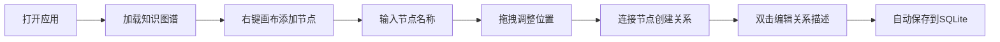

## 1. 产品概述
离线个人知识管理软件，通过知识图谱形式可视化展示概念节点及其关系，帮助用户组织和连接知识。
- 核心目的：提供一个离线、安全的知识管理工具，通过图形化方式呈现知识网络
- 目标用户：研究者、学生、知识工作者

## 2. 核心功能

### 2.1 用户角色
无需用户角色区分，单用户本地应用。

### 2.2 功能模块
1. **知识图谱主界面**：节点展示、连线关系、交互操作
2. **节点管理**：添加、删除、编辑节点（概念）
3. **关系管理**：添加、删除、编辑连线关系描述
4. **数据持久化**：本地SQLite存储，离线可用

### 2.3 页面详情
| 页面名称 | 模块名称 | 功能描述 |
|-----------|-------------|---------------------|
| 主界面 | 知识图谱画布 | 使用React Flow展示节点和连线，支持拖拽、缩放、平移 |
| 主界面 | 右键菜单 | 右键点击画布添加新节点，右键点击节点编辑/删除 |
| 主界面 | 连线交互 | 双击连线弹出编辑框修改关系描述 |
| 主界面 | 工具栏 | 基础操作按钮（保存、清空、导出） |

## 3. 核心流程
用户打开应用 → 查看已有知识图谱 → 右键添加新节点 → 拖拽节点到合适位置 → 连接两个节点创建关系 → 双击连线编辑关系描述 → 数据自动保存到本地SQLite

## 4. 用户界面设计
### 4.1 设计风格
- 主色调：深灰蓝（#1e293b）背景配青色（#06b6d4）高亮
- 按钮风格：圆角胶囊按钮，悬停有微妙缩放动画
- 字体：使用Inter作为主要字体，清晰现代
- 布局风格：全屏画布，简洁工具栏置顶
- 图标风格：简约线性图标

### 4.2 页面设计概述
| 页面名称 | 模块名称 | UI元素 |
|-----------|-------------|-------------|
| 主界面 | 知识图谱画布 | 深色背景、节点卡片、曲线连线、关系标签 |
| 主界面 | 右键菜单 | 浮动菜单、平滑动画、悬停高亮 |
| 主界面 | 编辑弹窗 | 模态框、输入框、确认/取消按钮 |

### 4.3 响应性
桌面端优先设计，支持窗口大小调整，画布自适应缩放。
