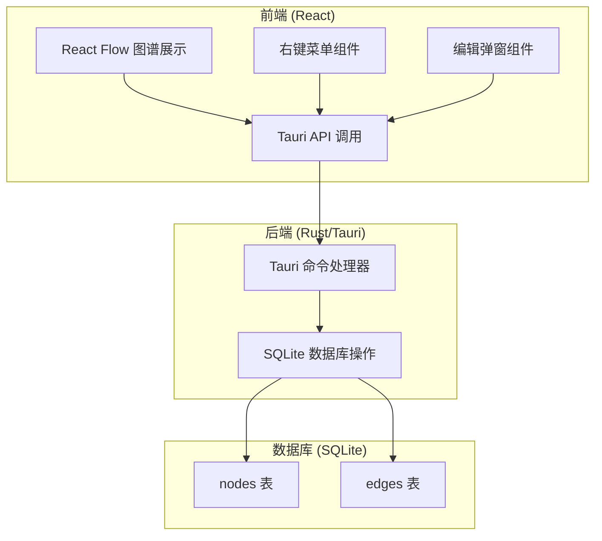
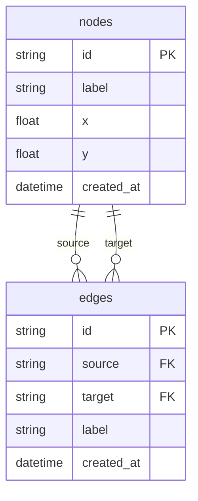

## 1. 架构设计



## 2. 技术描述
- **前端框架**: React@18 + TypeScript + Vite
- **桌面框架**: Tauri@1
- **图谱库**: React Flow@11
- **样式**: TailwindCSS@3
- **数据库**: SQLite (rusqlite)
- **初始化工具**: create-tauri-app

## 3. 目录结构
```
knowledge-graph-app/
├── src/
│   ├── components/
│   │   ├── GraphCanvas.tsx
│   │   ├── ContextMenu.tsx
│   │   └── EditModal.tsx
│   ├── types/
│   │   └── index.ts
│   ├── App.tsx
│   └── main.tsx
├── src-tauri/
│   ├── src/
│   │   ├── db.rs
│   │   └── main.rs
│   └── Cargo.toml
└── package.json
```

## 4. Tauri 命令定义
| 命令名称 | 参数 | 返回值 | 说明 |
|-----------|------|--------|------|
| get_nodes | 无 | Vec<Node> | 获取所有节点 |
| add_node | label: string, x: number, y: number | Node | 添加新节点 |
| update_node | id: string, label: string | Node | 更新节点 |
| delete_node | id: string | boolean | 删除节点 |
| get_edges | 无 | Vec<Edge> | 获取所有连线 |
| add_edge | source: string, target: string, label: string | Edge | 添加新连线 |
| update_edge | id: string, label: string | Edge | 更新连线 |
| delete_edge | id: string | boolean | 删除连线 |

## 5. 数据模型

### 5.1 数据模型定义


### 5.2 数据库初始化SQL
```sql
CREATE TABLE IF NOT EXISTS nodes (
    id TEXT PRIMARY KEY,
    label TEXT NOT NULL,
    x REAL NOT NULL,
    y REAL NOT NULL,
    created_at DATETIME DEFAULT CURRENT_TIMESTAMP
);

CREATE TABLE IF NOT EXISTS edges (
    id TEXT PRIMARY KEY,
    source TEXT NOT NULL,
    target TEXT NOT NULL,
    label TEXT,
    created_at DATETIME DEFAULT CURRENT_TIMESTAMP,
    FOREIGN KEY (source) REFERENCES nodes(id),
    FOREIGN KEY (target) REFERENCES nodes(id)
);
```

## 6. TypeScript 类型定义
```typescript
interface NodeData {
  label: string;
}

interface EdgeData {
  label: string;
}

type GraphNode = Node<NodeData>;
type GraphEdge = Edge<EdgeData>;
```
